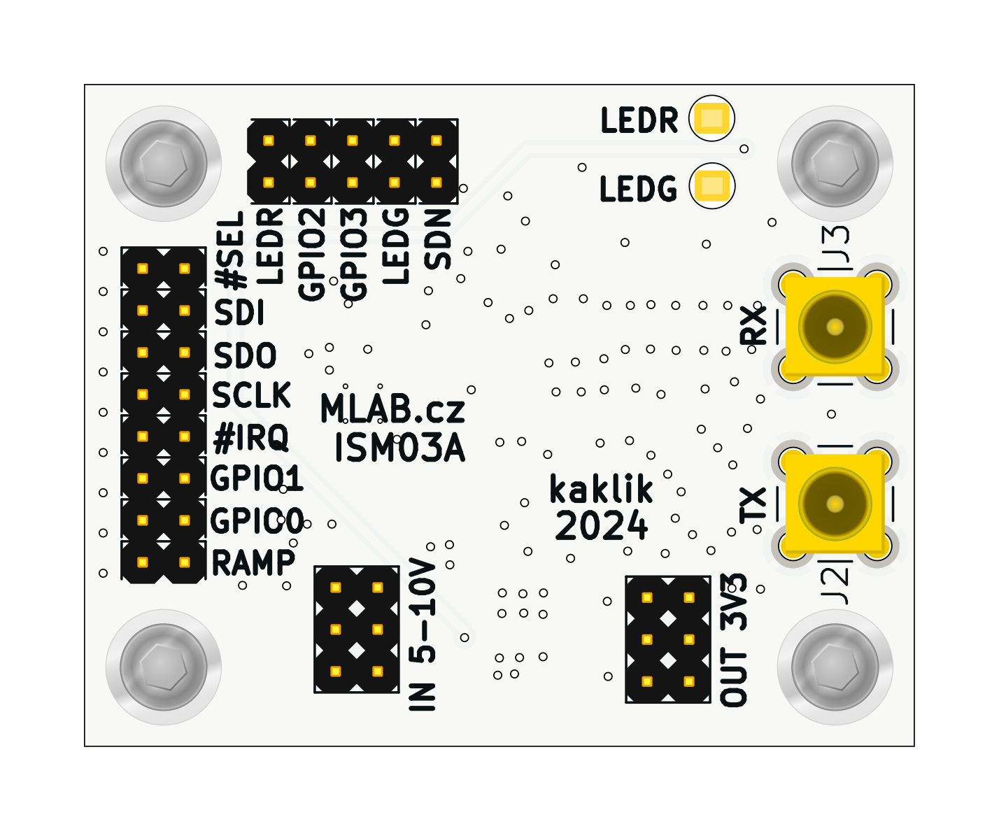
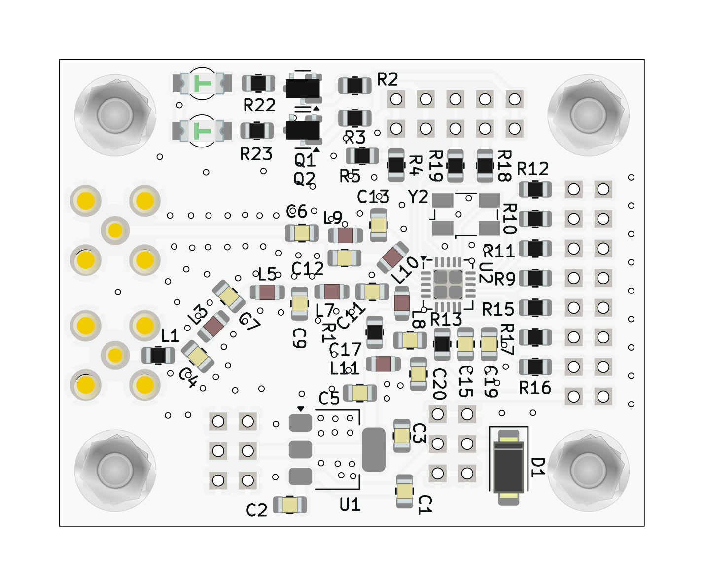

# ISM03 - Si4463-based transceiver with SPI interface

The ISM03 is a high-performance wireless transceiver designed for long-distance data transmission. The module is based on the [Si4463 chip](https://www.silabs.com/wireless/proprietary/ezradiopro-sub-ghz-ics/device.si4463?tab=specs) from Silicon Labs. It has a wide frequency range and output power, it is ideal for applications that require robust and reliable wireless communication.

ISM03 can operate on the open 433 or 868 MHz frequencies, which are popular in many applications.

## Parameters

- Based on the Si4463 chip
- Chip frequency range: 142 to 1050 MHz, with the ability to operate on the open 433 or 868 MHz frequencies
- Chip output power: -20 to 20 dBm
- The Si4463 chip includes a programmable block capable of controlling radio settings and supports the SPI interface
- Power supply: 5-12V with integrated 3.3V stabilizer
- Communication: SPI, GPIO
- Accessible GPIO signals directly from the transceiver
- Status indication: Two LEDs controlled from the Si chip
- Antenna connectors: MCX for RX and TX antennas. For bidirectional communication with a single antenna, connecting the [RFSWITCH module](www.mlab.cz/module/RFSWITCH01/) is recommended, which serves as an RF switch and enables MIMO 2x2 support. ISM03 can control the RFSWITCH module through GPIO pins

## Possible Applications

The MLAB ISM03 module with the Si4463 transceiver is suitable for various applications. It can be used in areas such as:

- **Remote Control**: The module can be used for wireless control of various devices, such as drones, RC cars, or home automation.
- **Data Links**: With a suitable firmware, the module can function as a [SiK data communication link](https://ardupilot.org/copter/docs/common-sik-telemetry-radio.html), which can transmit [MAVLink packets](https://mavlink.io/en/). MAVLink is a protocol designed for communication with unmanned vehicles and is supported by the most widespread autopilots Ardupilot and PX4. This is ideal for applications that require wireless data transmission.
- **Wireless Sensor Networks**: The module can be used to create wireless sensor networks in IoT applications.

> Based on this module, the company [ThunderFly](https://www.thunderfly.cz) has developed a module optimized for use on drones, which combines this ISM03 module, RFSWITCH01A, and additional RF filters and LNA. That could be integrated directly to the autopilot PCB to save weight.

## Links to Related Resources

- [Silicon Labs Si4463 Product Page](https://www.silabs.com/wireless/proprietary/ezradiopro-sub-ghz-ics/device.si4463?tab=specs)
- [Si4463 Datasheet](https://www.silabs.com/documents/public/data-sheets/Si4464-63-61-60.pdf)
- [MavLink Protocol](https://mavlink.io/en/)
- [SiK Radio](https://ardupilot.org/copter/docs/common-sik-telemetry-radio.html)
- [EZRADioPRO Family](https://www.silabs.com/wireless/proprietary/ezradiopro-sub-ghz-ics)
- [TFSIK01 Module by ThunderFly](https://github.com/ThunderFly-aerospace/TFSIK01/)

---
